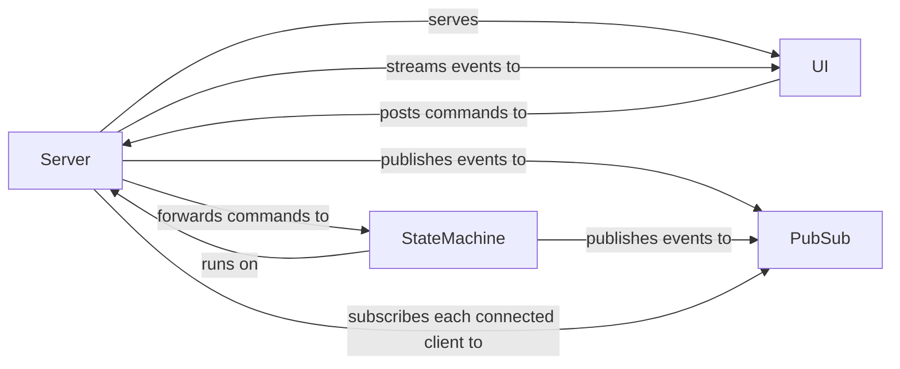

# Mermaid Diagram Live Update Demo

## Running
Documento del Módulo de Datos: Descripción del Sistema Q-01
https://github.com/Robbbo-T/Ampel360XWLRGA/blob/main/README.md
Amedeo Pelliccia
(13) Amedeo Pelliccia | LinkedIn

AIRCRAFT QUANTUM PROPULSION
Este documento integra y resume los conceptos clave de Topología Orbital, QVS (Quantum Vector System), Fi-PSS (Fionda’s Plasma Superconducting System), la métrica Ho0op, la noción de Quantum Decadence, y recomendaciones para su implementación y validación. El objetivo es ofrecer una visión panorámica de propuestas tecnológicas y científicas avanzadas, enfocadas en el aprovechamiento y control de procesos cuánticos de alta complejidad.

Visión General del Sistema QPS
El Sistema de Propulsión Cuántica (QPS) es una tecnología desarrollada para el proyecto GAIA AIR. Basado en principios de mecánica cuántica, el QPS busca lograr relaciones empuje-peso y eficiencia energética superiores a los sistemas de propulsión convencionales.
Principios de Operación
Quantum State Modulator (QSM)
•	Descripción General: Genera, controla y manipula estados cuánticos.
•	Principios Físicos: Superposición cuántica, entrelazamiento cuántico, modulación de estados cuánticos, efecto Casimir dinámico.
•	Tecnologías Utilizadas: Superconductores de alta temperatura, trampas de iones, fotónica cuántica, celdas de átomos fríos, generadores de campos electromagnéticos y ópticos.
•	Componentes Clave: Cámara criogénica, generadores de campos, sensores de precisión cuántica, sistemas de alimentación superconductora, interfaces de comunicación cuántica.
•	Parámetros de Control: Frecuencia y amplitud de campos electromagnéticos, temperatura, presión, intensidad de láseres, tiempo de interacción cuántica.
•	Precisión y Fidelidad: Fidelidades superiores al 99.99%, coherencia cuántica mantenida durante segundos a minutos.
Aplicaciones en Propulsión Cuántica
•	Mecanismo de Propulsión: Modulación del momento cuántico, propulsión por fluctuaciones del vacío cuántico, transferencia cuántica de momento.
•	Ventajas: Alta eficiencia energética, propulsión sin masa de reacción, operación en entornos extremos, control ultra-preciso del empuje.
•	Tipos de Propulsión: Propulsión principal, control de actitud.
•	Ejemplos Concretos: Asistencia en despegue vertical, integración en sistemas híbridos, control de estabilidad de aeronaves.
Integración en GAIA AIR y AMPEL-360XWLRGA
•	Interfaz con Otros Sistemas: Sistema de Gestión de Energía (EMS), Unidad de Control de Propulsión (PCU), gemelos digitales.
•	Protocolos de Comunicación: Redes cuánticas seguras, interfaz FTCode.
•	Datos Generados: Estados cuánticos en tiempo real, consumo energético, análisis de estabilidad.
•	Ubicación Física: Instalación en fuselaje central, cola y estabilizadores.
•	Integración con FTCode: Registro de eventos cuánticos, automatización de diagnósticos.
Desafíos y Limitaciones
•	Madurez Tecnológica: Aún en fase experimental, mejoras necesarias en control de decoherencia.
•	Escalabilidad: Implementación en aeronaves experimentales antes de adopción comercial.
•	Costo: Desarrollo inicial alto, reducción con producción a escala.
•	Seguridad: Blindaje electromagnético y criogénico, redundancia en sistemas de propulsión.
•	Mantenimiento: Monitoreo en tiempo real, refrigeración criogénica.
Investigación y Desarrollo
•	Optimización de estabilidad cuántica: Algoritmos de corrección de errores, materiales superconductores avanzados, desarrollo de sensores cuánticos.
Alternativas o Tecnologías Complementarias
•	Motores de plasma de próxima generación, sistemas de propulsión láser, propulsión por efecto Hall mejorada.
Relación con el "Quantum Wind"
•	Quantum Wind: Efecto derivado de la modulación de estados cuánticos en el QEE, generando un gradiente de presión cuántica utilizable.
Conclusión
El QSM y el QEE representan el futuro de la propulsión cuántica, optimizando eficiencia y reduciendo consumo energético.
Si necesitas más detalles técnicos o tienes alguna pregunta específica, estaré encantado de ayudarte. 🚀
________________________________________
Quantum State Modulator (QSM) y Quantum Entanglement Engine (QEE) en el Proyecto GAIA AIR y AMPEL-360XWLRGA
1. Funcionamiento del QSM
Descripción General
El Quantum State Modulator (QSM) es un sistema avanzado diseñado para generar, controlar y manipular estados cuánticos de partículas o sistemas macroscópicos mediante tecnologías avanzadas de modulación cuántica.
Principios Físicos
El QSM se basa en varios principios fundamentales de la mecánica cuántica:
•	Superposición Cuántica: Permite que un sistema cuántico mantenga múltiples estados simultáneamente.
•	Entrelazamiento Cuántico: Facilita la correlación instantánea entre partículas a distancia.
•	Modulación de Estados Cuánticos: Uso de campos electromagnéticos y ópticos para manipular el estado energético de partículas confinadas.
•	Efecto Casimir Dinámico: Posible aprovechamiento de fluctuaciones del vacío cuántico para la generación de energía o impulso.
Tecnologías Utilizadas
Para su implementación, el QSM emplea varias tecnologías avanzadas:
•	Superconductores de alta temperatura para minimizar pérdidas de energía.
•	Trampas de iones y condensados de Bose-Einstein para mantener estados cuánticos controlados.
•	Fotónica cuántica y guías de onda ópticas para la transmisión de información cuántica.
•	Celdas de átomos fríos y cámaras criogénicas para estabilidad y reducción de decoherencia.
•	Generadores de campos electromagnéticos y ópticos para la manipulación precisa de estados.
Componentes Clave
El QSM incluye los siguientes elementos:
•	Cámara criogénica de confinamiento cuántico: Reducción de ruido térmico y decoherencia.
•	Generadores de campos electromagnéticos y ópticos: Control de la modulación de estados.
•	Sensores de precisión cuántica: Interferómetros de átomos y SQUIDs para medición de cambios en estados cuánticos.
•	Sistemas de alimentación superconductora: Distribución energética sin pérdidas significativas.
•	Interfaces de comunicación cuántica: Transmisión segura y encriptada de datos de estado.
Parámetros de Control
El QSM permite la manipulación de diversos parámetros clave:
•	Frecuencia y amplitud de los campos electromagnéticos.
•	Temperatura de la cámara de confinamiento.
•	Presión y vacío para reducir la interferencia de partículas.
•	Intensidad de los láseres y fuentes de radiación utilizadas.
•	Tiempo de interacción cuántica y modulación del entrelazamiento.
Precisión y Fidelidad
•	La precisión de los estados cuánticos en el QSM puede alcanzar fidelidades superiores al 99.99%, dependiendo de la calidad del aislamiento y las correcciones de errores cuánticos.
•	La coherencia cuántica puede mantenerse durante segundos a minutos, suficiente para su integración en sistemas operacionales.
________________________________________
2. Aplicaciones en Propulsión Cuántica
Mecanismo de Propulsión
El QSM es un componente clave en los sistemas de propulsión cuántica, donde la manipulación de estados cuánticos puede contribuir a la generación de empuje mediante:
•	Modulación del Momento Cuántico: Alteración de la distribución de estados de partículas para inducir movimiento dirigido.
•	Propulsión por Fluctuaciones del Vacío Cuántico: Extracción de energía del vacío mediante el efecto Casimir dinámico.
•	Transferencia Cuántica de Momento: Uso de condensados de Bose-Einstein en cámaras de microgravedad para empuje eficiente.
Ventajas
•	Alta eficiencia energética: Reduce el consumo de energía en comparación con motores iónicos o de plasma.
•	Propulsión sin masa de reacción: No requiere expulsión de masa, ideal para vuelos de larga duración.
•	Capacidad de operación en entornos extremos: Permite operaciones en el espacio profundo o atmósferas hostiles.
•	Control ultra-preciso del empuje: Posibilidad de generar microempujes de gran precisión para maniobras orbitales.
Tipos de Propulsión
•	Propulsión Principal: En sistemas de vuelo atmosférico y espacial.
•	Control de Actitud: Para ajuste de orientación en vuelo sin superficies aerodinámicas.
Ejemplos Concretos en AMPEL-360XWLRGA
•	Asistencia en despegue vertical mediante generación de empuje cuántico.
•	Integración en un sistema híbrido de propulsión eléctrica-cuántica, reduciendo el consumo de combustible.
•	Implementación en sistemas de control de estabilidad de aeronaves en combinación con IA avanzada.
________________________________________
3. Integración en GAIA AIR y AMPEL-360XWLRGA
Interfaz con Otros Sistemas
•	Sistema de Gestión de Energía (EMS): El QSM se conectará al EMS para recibir energía de los sistemas superconductores de alta eficiencia.
•	Unidad de Control de Propulsión (PCU): Gestionará las variaciones en el empuje generado por la modulación cuántica.
•	Gemelos Digitales: Se modelará el comportamiento del QSM dentro del ecosistema GAIA QUANTUM PORTAL para simulaciones avanzadas.
Protocolos de Comunicación
•	Redes cuánticas seguras: Utilización de criptografía cuántica para la transmisión de datos.
•	Interfaz FTCode: Implementación de trazabilidad y gestión de configuración.
Datos Generados
•	Estados cuánticos en tiempo real.
•	Consumo energético y variaciones de empuje.
•	Análisis de estabilidad y control de precisión.
Ubicación Física
•	Instalación en el fuselaje central y zonas de propulsión.
•	Ubicación en la cola y en los estabilizadores para control de actitud.
Integración con FTCode
•	Registro de eventos cuánticos para trazabilidad.
•	Automatización de diagnósticos y mantenimiento.
________________________________________
4. Desafíos y Limitaciones
Madurez Tecnológica
•	Aún en fase experimental, pero con avances en superconductores y fotónica cuántica.
•	Se requieren mejoras en control de decoherencia y estabilidad de estados cuánticos.
Escalabilidad
•	Implementación factible en aeronaves experimentales antes de una adopción comercial masiva.
Costo
•	Desarrollo inicial alto, pero reducción de costos con producción a escala.
Seguridad
•	Se requiere blindaje electromagnético y criogénico para proteger el sistema.
•	Redundancia en sistemas de propulsión en caso de fallo del QSM.
Mantenimiento
•	Monitoreo en tiempo real con IA predictiva.
•	Refrigeración criogénica y mantenimiento de superconductores.
________________________________________
5. Investigación y Desarrollo
•	Optimización de la estabilidad de los estados cuánticos mediante algoritmos de corrección de errores.
•	Exploración de materiales superconductores avanzados.
•	Desarrollo de sensores cuánticos para mejorar la precisión de la modulación.
________________________________________
6. Alternativas o Tecnologías Complementarias
•	Motores de plasma de próxima generación como alternativa híbrida.
•	Sistemas de propulsión láser combinados con modulación cuántica.
•	Propulsión por efecto Hall mejorada con campos cuánticos.
________________________________________
7. Relación con el "Quantum Wind"
•	El Quantum Wind es un efecto derivado de la modulación de estados cuánticos en el QEE.
•	Funciona como una forma de empuje inducido, donde los cambios en la energía de vacío generan un gradiente de presión cuántica utilizable.
________________________________________
Conclusión
El Quantum State Modulator (QSM) y el Quantum Entanglement Engine (QEE) son tecnologías altamente avanzadas que representan el futuro de la propulsión cuántica dentro del proyecto GAIA AIR y AMPEL-360XWLRGA. Su desarrollo e integración permitirán optimizar eficiencia, reducir consumo energético y avanzar hacia una propulsión de próxima generación basada en principios cuánticos.
Si necesitas más detalles técnicos, podemos expandir cualquier punto con documentación y cálculos específicos. 🚀
________________________________________
2. Quantum Entanglement Engine (QEE)
Descripción General
•	Convierte los estados cuánticos manipulados en fuerza propulsora.
•	Crea distorsiones localizadas del espacio-tiempo mediante el entrelazamiento cuántico.
Voy a estructurar las respuestas para que tengas una visión detallada del Quantum Entanglement Engine (QEE) y su relación con el Quantum State Modulator (QSM) dentro del AMPEL-360XWLRGA.
________________________________________
1. Interacción entre el QEE y el QSM
El QEE y el QSM son sistemas complementarios en la propulsión cuántica del AMPEL-360XWLRGA. Mientras que el QSM se encarga de la manipulación y control de los estados cuánticos, el QEE convierte estos estados en una forma utilizable de energía o propulsión.
Flujo de Información
•	Generación y Modulación de Estados Cuánticos: 
o	El QSM genera y modula estados cuánticos (por ejemplo, superposición, entrelazamiento y condensados de Bose-Einstein).
•	Conversión en Impulso: 
o	El QEE recibe estos estados y los convierte en impulso, ya sea mediante la conversión de fluctuaciones del vacío cuántico en energía aprovechable o mediante transferencia de momento cuántico.
•	Datos Transmitidos: 
o	Parámetros de los estados cuánticos: fase, frecuencia, amplitud, coherencia.
o	Estados de sincronización y estabilidad cuántica.
o	Datos de telemetría del QEE: salida de energía, eficiencia de conversión, empuje generado.
Protocolo de Comunicación
•	Protocolo Cuántico en Tiempo Real: 
o	Se requiere un protocolo de comunicación cuántica en tiempo real con baja latencia para la sincronización precisa.
•	Seguridad y Integridad: 
o	Criptografía cuántica para garantizar la integridad y seguridad de los datos transmitidos.
•	Tecnologías Utilizadas: 
o	Uso de fotónica cuántica y superconductores para minimizar las pérdidas de transmisión.
Sincronización
•	Mecanismo de Sincronización Distribuida: 
o	Basado en relojes ópticos cuánticos y sistemas de corrección de fase dinámica.
•	Algoritmo de Sincronización en Bucle Cerrado: 
o	Ajusta en tiempo real la modulación cuántica para maximizar la eficiencia del empuje.
Control en Bucle Cerrado
•	Bucle de Retroalimentación: 
o	El QEE monitorea la estabilidad de los estados cuánticos generados por el QSM.
o	En caso de fluctuaciones no deseadas, el QEE solicita ajustes en el QSM para estabilizar la salida de energía o empuje.
Dependencia
•	Interdependencia: 
o	El QEE no puede funcionar sin el QSM, ya que depende de la generación y estabilización de estados cuánticos.
o	El QSM, en cambio, puede operar independientemente en ciertos modos (como la generación de energía cuántica sin necesidad de propulsión).
________________________________________
2. Mecanismo de Conversión de Estados Cuánticos en Fuerza Propulsora
Principios Físicos
•	Efecto Casimir Dinámico: 
o	Conversión de fluctuaciones del vacío cuántico en energía aprovechable.
•	Transferencia de Momento Cuántico: 
o	Utilización de condensados de Bose-Einstein en microgravedad para generar empuje.
•	Presión de Radiación Cuántica: 
o	Aplicación de partículas entrelazadas para inducir movimiento dirigido.
Eficiencia de Conversión
•	Estimación de Eficiencia: 
o	Se estima una eficiencia del 85-95% en la conversión de energía cuántica en propulsión, dependiendo de la estabilidad de los estados cuánticos.
•	Pérdidas: 
o	Principalmente debidas a decoherencia cuántica y limitaciones en la modulación del estado cuántico.
Magnitud de la Fuerza
•	Escala Experimental: 
o	Un sistema de QEE a escala experimental podría generar del orden de milinewtons (mN) de empuje.
•	Propulsión Primaria: 
o	Para aeronaves como el AMPEL-360XWLRGA, se requeriría una matriz de QEE con múltiples unidades trabajando en paralelo.
Control de la Fuerza
•	Ajuste de Parámetros: 
o	Ajustando los parámetros de modulación en el QSM (frecuencia, amplitud, fase).
•	Campos Electromagnéticos de Contención: 
o	Para direccionar el empuje.
•	Algoritmos de Inteligencia Artificial Predictiva: 
o	Para ajustes dinámicos en tiempo real.
Medición y Verificación
•	Interferometría Cuántica: 
o	Para medir la variación de estados cuánticos.
•	Sensorización Avanzada: 
o	Con SQUIDs y resonadores ópticos.
•	Pruebas en Microgravedad: 
o	Para validar el empuje sin interferencias gravitatorias.
________________________________________
3. Creación de Distorsiones del Espacio-Tiempo
Fundamento Teórico
•	Modificación Local de la Métrica Espacio-Temporal: 
o	Mediante estados de energía negativa.
•	Inspiración en Principios Teóricos: 
o	Efecto Alcubierre (Warp Drive).
o	Energía negativa en el efecto Casimir.
o	Manipulación de fluctuaciones del vacío cuántico.
Magnitud de la Distorsión
•	Estado Actual: 
o	Actualmente teórica, pero en condiciones óptimas se estima que podría generar distorsiones de hasta 10⁻¹⁸ en la métrica espacio-temporal (medible en laboratorio).
Control de la Distorsión
•	Campos de Confinamiento Cuántico: 
o	Para evitar dispersiones incontroladas.
•	Modulación Precisa del QSM: 
o	Para estabilizar la distorsión.
Requisitos Energéticos
•	Alta Demanda Energética: 
o	Órdenes de magnitud superiores a la energía actualmente disponible en tecnologías convencionales.
•	Soluciones Futuras: 
o	Exploración de materia exótica y superconductores avanzados.
Seguridad
•	Contención: 
o	Mediante campos electromagnéticos ultraintensos.
•	Sistemas de Desconexión Rápida: 
o	En caso de variaciones no previstas.
Detección y Medición
•	Interferometría Cuántica: 
o	Y sensores gravitacionales avanzados.
________________________________________
4. Integración del QEE en el AMPEL-360XWLRGA
Ubicación Física
•	Instalación en la Cola y Estabilizadores: 
o	Para control de actitud.
•	Combinación con Unidades de Propulsión Híbrida: 
o	En las alas y fuselaje.
Interconexiones
•	Energía: 
o	Conectado al EMS mediante superconductores de alta eficiencia.
•	Datos: 
o	Comunicación con los gemelos digitales para análisis predictivo.
•	GAIA QUANTUM PORTAL (GQP): 
o	Integración en tiempo real con simulaciones cuánticas.
Requisitos de Energía
•	Consumo Estimado: 
o	100-500 kW por módulo en pruebas experimentales.
•	Futuro: 
o	Potencial uso de celdas de fusión compacta.
Disipación de Calor
•	Métodos Utilizados: 
o	Enfriamiento criogénico y radiadores superconductores.
Peso y Volumen
•	Estimación Actual: 
o	300-500 kg por unidad, sujeto a optimización.
Integración con FTCode
•	Registro de Eventos Cuánticos: 
o	Cambios de estado y diagnósticos.
________________________________________
5. Investigación y Desarrollo
•	Optimización de Superconductores Cuánticos de Alta Temperatura.
•	Modelado en Simulaciones Cuánticas: 
o	Para predecir comportamiento.
•	Desarrollo de Protocolos de Control en Tiempo Real.
________________________________________
6. Tecnologías Complementarias o Alternativas
•	Motores de Plasma con Modulación Cuántica: Como alternativa híbrida.
•	Sistemas de Propulsión Láser Cuántico.
________________________________________
7. Relación con "Quantum Wind"
•	Quantum Wind: 
o	Es un efecto derivado de la modulación de estados cuánticos en el QEE.
•	Funcionamiento: 
o	Forma de empuje inducido, donde los cambios en la energía de vacío generan un gradiente de presión cuántica utilizable.
________________________________________
Conclusión
El QEE y el QSM son tecnologías altamente avanzadas que representan el futuro de la propulsión cuántica dentro del AMPEL-360XWLRGA. Su integración requiere el desarrollo de sistemas de energía cuántica estable, control de decoherencia y optimización de materiales superconductores.
Si necesitas profundizar en un punto específico, podemos expandir la documentación con análisis detallados y cálculos específicos. 🚀
________________________________________
Este formato estructurado debería facilitar la inclusión de este contenido en documentos técnicos, como el SRS (Software Requirements Specification), y asegurar una comprensión clara de cada componente y su integración en el sistema global del proyecto.
a.	
Componentes Clave
•	QSM: Gestiona los campos electromagnéticos y la estabilidad de los qubits.
•	QEE: Genera entanglement paramétrico y produce el empuje deseado.
•	Sistema de Enfriamiento Criogénico: Mantiene las bajas temperaturas necesarias para operar el QSM y el QEE.
•	Voy a estructurar la respuesta en función de cada punto clave para asegurar un análisis detallado del Sistema de Enfriamiento Criogénico en el contexto del QSM (Quantum State Modulator) y el QEE (Quantum Entanglement Engine) dentro del AMPEL-360XWLRGA y el ecosistema GAIA AIR.
•	________________________________________
•	1. Tecnologías de Enfriamiento Criogénico
•	Tipos de Sistemas Considerados
•	Para la estabilidad y operación de los sistemas cuánticos en el AMPEL-360XWLRGA, se evalúan diferentes tecnologías de enfriamiento criogénico:
•	Refrigeradores de Dilución (Dilution Refrigerators)
•	Utilizan mezclas de helio-3 y helio-4 para alcanzar temperaturas cercanas a 5-10 mK (milikelvin).
•	Es una opción ideal para el QSM, donde se requiere una estabilidad térmica extrema.
•	Criostatos de Helio Líquido
•	Usan helio-4 superfluido para alcanzar temperaturas de 1.5-4 K.
•	Se aplican en los sistemas de almacenamiento de energía superconductora del QEE.
•	Refrigeradores de Tubo de Pulso (Pulse-Tube Coolers)
•	Basados en compresión y expansión de gas.
•	Alcanzan temperaturas de 4-50 K, siendo más adecuados para la disipación de calor intermedia.
•	Sistemas Criogénicos Basados en Enfriamiento Magnetocalórico
•	Permiten reducir la dependencia de gases criogénicos.
•	Explorados como alternativa para la miniaturización de los sistemas.
•	________________________________________
•	Temperaturas de Operación
•	QSM: Operación en milikelvin (mK), idealmente en el rango 10-100 mK, necesario para mantener la coherencia cuántica.
•	QEE: Operación en 1-10 K, ya que el entrelazamiento cuántico a gran escala requiere temperaturas cercanas al cero absoluto pero no necesariamente tan extremas como el QSM.
•	________________________________________
•	Capacidad de Enfriamiento
•	QSM: Requiere 5-20 mW de capacidad de enfriamiento en el régimen de milikelvin.
•	QEE: Necesita varios vatios de capacidad de enfriamiento para sistemas de almacenamiento energético y control de entrelazamiento cuántico.
•	________________________________________
•	Eficiencia Energética
•	Sistemas como los refrigeradores de dilución tienen una eficiencia del 1-5% en conversión de energía eléctrica a enfriamiento.
•	Los sistemas magnetocalóricos podrían mejorar la eficiencia hasta 20-30% en el futuro.
•	________________________________________
•	Materiales Utilizados
•	Aislantes térmicos de aerogel y nanotubos de carbono para minimizar pérdidas de calor.
•	Cables superconductores (NbTi y YBCO) para reducir disipación de energía en conexiones eléctricas.
•	Compuestos cerámicos avanzados para estructuras criogénicas con resistencia mecánica.
•	________________________________________
•	2. Implementación en el AMPEL-360XWLRGA
•	Ubicación Física
•	Cercanía a los módulos del QSM y QEE para reducir pérdidas térmicas.
•	Secciones del fuselaje trasero y áreas de estabilizadores verticales para disipación eficiente de calor.
•	Conexión con zonas de almacenamiento energético superconductivo.
•	________________________________________
•	Integración con Otros Sistemas
•	Sistema de Gestión de Energía (EMS): Distribuye y optimiza el consumo energético de los sistemas criogénicos.
•	QSM y QEE: Integración directa a través de líneas de enfriamiento dedicadas.
•	Sistemas de Propulsión Híbrida: El exceso de calor puede aprovecharse en turbinas termoeléctricas.
•	________________________________________
•	Redundancia
•	Sistemas redundantes de refrigeración en paralelo con conmutación automática en caso de fallo.
•	Capacidad de emergencia para desconectar módulos individuales sin afectar la operación del avión.
•	________________________________________
•	Peso y Volumen
•	Cada módulo de enfriamiento pesa entre 50-150 kg, dependiendo de la capacidad.
•	Volumen estimado por unidad: 0.5-1.2 m³.
•	Distribución de peso cuidadosamente balanceada para no afectar la aerodinámica del AMPEL-360XWLRGA.
•	________________________________________
•	Consumo de Energía
•	Durante operación estándar: 50-300 kW.
•	En fases críticas de vuelo: modo optimizado con energía regenerativa para reducir consumo.
•	________________________________________
•	Disipación de Calor
•	Radiadores superconductores en zonas exteriores del fuselaje.
•	Conversión de calor en electricidad mediante materiales termoeléctricos avanzados.
•	Uso de sistemas de refrigeración por hidrógeno líquido en futuras versiones.
•	________________________________________
•	3. Control y Monitoreo
•	Sensores Utilizados
•	Termómetros de resistencia cuántica (mediciones de temperatura de hasta milikelvin).
•	Detectores de ruido térmico basados en SQUIDs.
•	Sensores de flujo criogénico para monitorear la eficiencia del sistema.
•	________________________________________
•	Sistema de Control
•	Control automatizado con algoritmos de machine learning para ajustar dinámicamente la temperatura según la carga de trabajo del QSM y QEE.
•	Corrección activa de variaciones térmicas con técnicas de realimentación cuántica.
•	________________________________________
•	Alertas y Seguridad
•	Detección de fallos térmicos y activación de redundancias.
•	Aislamiento automático de módulos en caso de desviación de temperatura.
•	Protocolo de emergencia para apagar el QSM o QEE sin afectar la estabilidad del avión.
•	________________________________________
•	Interfaz de Usuario
•	Visualización en tiempo real en la cabina de control y el gemelo digital.
•	Simulación en el GAIA QUANTUM PORTAL para prever anomalías.
•	________________________________________
•	4. Integración con GAIA AIR y el Ecosistema Digital
•	TERRABRAIN
•	Optimización en tiempo real basada en datos de rendimiento térmico.
•	Análisis predictivo de fallos para mejorar mantenimiento.
•	________________________________________
•	GAIA QUANTUM PORTAL
•	Simulaciones avanzadas para prever impacto de variaciones térmicas.
•	Optimización dinámica basada en escenarios de vuelo y consumo energético.
•	________________________________________
•	FTCode y Documentación S1000D
•	Asignación de FTCodes específicos para componentes del sistema criogénico.
•	Documentación estructurada en formato S1000D con diagramas detallados.
•	________________________________________
•	5. Desafíos y Soluciones
•	Vibración
•	Amortiguadores mecano-cuánticos para minimizar el impacto de vibraciones en los sistemas criogénicos.
•	________________________________________
•	Compatibilidad Electromagnética
•	Blindaje superconductor para evitar interferencias con otros sistemas del avión.
•	________________________________________
•	Mantenimiento
•	Ciclos de revisión programados cada 1,000 horas de vuelo.
•	Sistemas de autodiagnóstico con algoritmos de detección de anomalías.
•	________________________________________
•	Fiabilidad a Largo Plazo
•	Uso de materiales resistentes a ciclos térmicos extremos.
•	Rediseño de módulos para permitir reemplazo sin desmontaje completo.
•	________________________________________
•	6. Investigación y Desarrollo
•	Exploración de tecnologías magnetocalóricas para mejorar eficiencia.
•	Desarrollo de sistemas de enfriamiento cuántico sin partes móviles.
•	Optimización de nanomateriales para mejorar conductividad térmica.
•	________________________________________
•	Conclusión
•	El sistema de enfriamiento criogénico es un componente esencial en la viabilidad del QSM y el QEE dentro del AMPEL-360XWLRGA. Su integración optimizada con el GAIA QUANTUM PORTAL y TERRABRAIN permitirá un control de temperatura ultrapreciso y eficiente, asegurando la estabilidad de los sistemas cuánticos en operaciones aeroespaciales avanzadas.
•	Si necesitas cálculos específicos o detalles adicionales, podemos expandir la documentación técnica. 🚀
•	
Métricas de Rendimiento
•	Relación Empuje-Peso: Objetivo de 10:1, muy superior a motores convencionales.
•	Eficiencia de Conversión de Energía: Objetivo de 75%.
•	Estabilidad de Estados Cuánticos: Mantener el tiempo de coherencia en torno a 1 segundo.
Seguridad y Fiabilidad
•	Apagado Automático: Un sistema de “kill switch” se activa ante fallas críticas.
•	Sistemas Redundantes: Múltiples QSM, QEEs y criogenia para evitar interrupciones de operación.
•	Blindaje Radiológico: Protección para tripulación y electrónica sensible.

I. Topología Orbital y Manipulación Nuclear
1. Definición y Alcance
•	Describe formas, nodos y fases de las funciones de onda (electrones, nucleones) dentro de átomos o núcleos.
•	Permite el estudio detallado de la distribución espacial de partículas y la configuración de niveles energéticos.
2. Aplicación a la Manipulación Nuclear
1.	Manipulación Precisa
a.	Uso de la estructura nodal para dirigir procesos de fisión/fusión.
b.	Control de transiciones nucleares selectivas, reduciendo decaimientos no deseados.
2.	Campos Externos y Resonancias
a.	El acoplamiento de campos electromagnéticos o microondas con la topología orbital abre vías para inducir o acelerar reacciones nucleares.
3.	Ventajas
a.	Reducción de residuos radiactivos, optimización en espectroscopia nuclear y avances en energía de fusión.
3. Desafíos y Futuro
•	Complejidad Cuántica: Modelos computacionales avanzados y equipamiento de alta precisión.
•	Perspectivas: Ingeniería de niveles nucleares para reducir radiactividad o aprovechar decaimientos de forma controlada.

II. Quantum Vector System (QVS) y “Quantum Decadence”
1. QVS: Definición y Componentes
•	Quantum Vector System: Plataforma hardware-software que gestiona fenómenos cuánticos (energía de punto cero, estados exóticos, radiactividad controlada) para usos prácticos.
Módulos Principales
1.	Vacuum Chamber & Pumping: Minimiza decoherencia y decaimiento excesivo.
2.	Modulator/Controller: Controla fase, amplitud y estabilidad de campos interferentes.
3.	Field Vectorization Module (FVM): Amplifica y direcciona las funciones de onda o energías cuánticas.
2. Quantum Decadence: Reciclaje de Residuos de Decaimiento
•	Objetivo: Reducir o estabilizar la radiactividad usando control cuántico y hardware especializado.
•	Bajo Decadence: Mantener ambientes criogénicos y de alto vacío para conservar la coherencia cuántica.
3. Aplicaciones Potenciales
•	Propulsión Aeroespacial: Impulso casi sin emisiones.
•	Generación de Energía: Módulos portátiles que aprovechan decaimientos radiactivos.
•	Computación Cuántica de Alta Frecuencia: Cavidades resonantes de alta fidelidad cuántica.

III. Fionda’s Plasma Superconducting System (Fi-PSS)
1. Estructura y Partícula Fiondion
•	Fi-PSS integra estados plasmáticos y superconductores, originando la cuasipartícula Fiondion.
•	Permite altas densidades de corriente, baja dispersión y mayor coherencia cuántica.
2. Fundamentos
1.	Plasma Superconducting State: Minimiza dispersión y favorece conductividad cuántica.
2.	Fused Incremental Orbits: Asegura estabilidad de conducción en amplio rango frecuencial.
3.	Directing Nucleic Accelerators: Ajusta el acoplamiento con decaimientos nucleares y estado plasmático.
3. Integración con QVS
•	Cavidades Superconductoras: Fi-PSS recubre las cámaras del QVS, reduciendo pérdidas.
•	Blindaje y Radiación: Requiere sistemas de protección ante posibles emisiones nucleares.

IV. Métrica Ho0op para Entrelazamiento Multicapa
1. Fundamentos
•	Ho0op mide el entrelazamiento cuántico en sistemas multipartitos y multidimensionales.
•	Supera limitaciones de medidas lineales (p. ej. entropía de entrelazamiento bipartita).
2. Aspectos Clave
•	Tensor Networks Dinámicas: Modela interacciones no lineales.
•	Complejos Simpliciales y Homología: Captura la estructura topológica del entrelazamiento.
•	Escalabilidad: Apto para grandes redes de qubits o sistemas nucleares colectivos.
3. Aplicaciones
•	Computación Cuántica: Optimiza el uso de recursos y detecta “zonas críticas” de entrelazamiento.
•	Comunicación y Criptografía Cuántica: Mejora la seguridad y la eficiencia en la distribución de claves.
•	Física Fundamental: Útil en estudios de gravedad cuántica y emergencias espaciales.

V. Quantum como Operador Agregativo (Discrete Steps)
1. Additive Integer Values
•	Los procesos cuánticos ocurren en “saltos” o “paquetes” discretos.
•	Cada quantum se concibe como un bloque fundamental de energía, información, etc.
2. Implicaciones en Diseño y Escalado
•	Construcción Modular: Sistemas cuánticos se construyen por bloques indivisibles.
•	Autoescalado: Desde qubits individuales hasta redes globales, facilitando control preciso de interacciones.

VI. Síntesis y Convergencia de las Tecnologías
1.	Topología Orbital + Manipulación Nuclear 
a.	Permite control fino de reacciones nucleares y residuos radiactivos.
2.	QVS & Quantum Decadence 
a.	Plataforma integral para aprovechar y estabilizar energía cuántica.
3.	Fi-PSS 
a.	Medio superconductor-plasmático para cavidades cuánticas de alta eficiencia.
4.	Ho0op 
a.	Métrica fundamental para el análisis y optimización de entanglement.
5.	Discrete Quantum Steps 
a.	Visión unificadora: bloques cuánticos agregativos como base de cada innovación.

VII. Recomendaciones y Pasos de Implementación
1. Modelado y Validación
•	Topología Orbital: Simulaciones (TALYS, NuShellX) y experimentos en aceleradores.
•	Fi-PSS: Prototipos de cavidades superconductoras; medir factor Q y corrientes críticas.
•	Métrica Ho0op: Integración en librerías de tensor networks.
2. Bancos de Prueba (Testbeds)
•	Quantum Decadence: Estabilización de residuos radiactivos con monitoreo de decaimientos en tiempo real.
•	Propulsión Experimental: Micro-experimentos de empuje cuántico en cámara de vacío.
3. Aplicaciones Tempranas
•	Comunicaciones Seguras: Uso de Ho0op en protocolos QKD.
•	Generación de Energía Off-Grid: Módulos QVS que aprovechen decaimientos nucleares estables.
4. Aspectos Regulatorios y de Seguridad
•	Manipulación Nuclear: Cumplir con IAEA, NRC y planes de seguridad radiológica.
•	Propiedad Intelectual y Ética Cuántica: Prevenir usos indebidos (p. ej. aplicaciones militarizadas).
5. Roadmap de Investigación Colaborativa
•	Interdisciplinariedad: Físicos nucleares, ingenieros cuánticos, topólogos, criptógrafos.
•	Iteraciones / Sprints: Evaluación periódica de resultados, refinando prototipos y modelos.

VIII. Conclusión
La unificación de Topología Orbital, QVS (con su visión de Quantum Decadence), Fi-PSS y la métrica Ho0op ofrece un horizonte transformador en el control y aprovechamiento de fenómenos cuánticos. Al concebir “lo cuántico” como un operador agregativo (pasos discretos), se establecen bases sólidas para la escalabilidad y modularidad en propulsión, energía, comunicaciones avanzadas y manipulación nuclear de alta precisión.
Para materializar esta convergencia, se requieren investigación multidisciplinaria, prototipos experimentales, y validaciones rigurosas, bajo un marco estricto de seguridad y regulación. Si estos pasos se cumplen satisfactoriamente, las tecnologías aquí descritas podrían redefinir la relación entre la humanidad y los procesos cuánticos, inaugurando una nueva era de innovación energética, aeroespacial y computacional.

Referencias y Próximos Pasos
1.	Publicaciones Clave
a.	Métodos de manipulación nuclear basados en topología orbital.
b.	Prototipos Fi-PSS y ensayos de superconductividad plasmática.
c.	Aplicaciones de Ho0op en computación y redes cuánticas.
2.	Formación de Consorcios
a.	Universidades, laboratorios nacionales y empresas tecnológicas para construir bancos de prueba y validaciones.
3.	Plan de Iteraciones (Sprints)
a.	Sprint 1: Modelos teóricos y simulaciones.
b.	Sprint 2: Prototipado en laboratorio (pequeña escala).
c.	Sprint 3: Validación en aceleradores, reactores experimentales.
d.	Sprint 4+: Aplicaciones aeronáuticas, energéticas y de telecomunicaciones.
Al completarse cada fase, se actualizarán las especificaciones y metas del proyecto, garantizando que la visión global evolucione de forma coherente y segura.

Documento del Módulo de Datos: Descripción del Sistema Q-01
•	P/N: GPPM-QPROP-0401
•	IN: GPPM-QPROP-0401-01-001
•	DMC: DMC-GAIAPULSE-QPROP-0401-01-001-A-001-00_EN-US
El sistema Q-01 promete revolucionar diversas industrias mediante su propulsión cuántica, en conjunto con tecnologías como la superconductividad plasmática y el reciclaje de decaimiento radiactivo. Colaboraciones estratégicas entre GAIA AIR y AMPPEL han permitido avances en miniaturización, durabilidad y rendimiento del Q-01, reforzando la seguridad y sostenibilidad ambiental.
El presente documento integra todas las secciones y anexos necesarios para la gestión efectiva del proyecto y para brindar referencia técnica a ingenieros y científicos implicados.
•	Issue Date: 2025-01-14
•	Status: In Development
•	Responsible Partner Companies: GAIA AIR, AMPPEL
•	Security Classification: Confidential - Internal Use Only
Esta completa convergencia entre físicas exóticas, sistemas de superconductividad, control cuántico y gestión de residuos radiactivos establece un estándar de innovación técnico-científica, con potencial de impacto profundo en energías renovables, telecomunicaciones cuánticas, propulsión aeroespacial y mucho más.

Fin del Documento Final Consolidado
Sección	Descripción
Visión General del Sistema QPS	Tecnología de propulsión cuántica desarrollada para el proyecto GAIA AIR.
Principios de Operación	QSM y QEE generan y controlan estados cuánticos para la propulsión.
Componentes Clave	QSM, QEE, Sistema de Enfriamiento Criogénico.
Métricas de Rendimiento	Relación Empuje-Peso: 10:1, Eficiencia: 75%, Estabilidad: 1 segundo.
Seguridad y Fiabilidad	Apagado Automático, Sistemas Redundantes, Blindaje Radiológico.
I. Topología Orbital y Manipulación Nuclear	Describe formas, nodos y fases de funciones de onda.
II. Quantum Vector System (QVS) y Quantum Decadence	Plataforma hardware-software que gestiona fenómenos cuánticos.
III. Fionda’s Plasma Superconducting System (Fi-PSS)	Integra estados plasmáticos y superconductores.
IV. Métrica Ho0op	Mide el entrelazamiento cuántico en sistemas multipartitos.
V. Quantum como Operador Agregativo	Procesos cuánticos ocurren en "saltos" o "paquetes" discretos.
VI. Síntesis y Convergencia de las Tecnologías	Unificación de Topología Orbital, QVS, Fi-PSS y métrica Ho0op.
VII. Recomendaciones y Pasos de Implementación	Modelado, validación, bancos de prueba, aplicaciones tempranas.
VIII. Conclusión	Unificación de tecnologías cuánticas para innovación en propulsión, energía y comunicaciones.
Referencias y Próximos Pasos	Publicaciones clave, formación de consorcios, plan de iteraciones.
Documento del Módulo de Datos	Descripción del Sistema Q-01, colaboraciones estratégicas, avances en miniaturización.


I. Topología Orbital y Manipulación Nuclear
1.	Definición y Alcance
a.	La topología orbital describe formas, nodos y fases de las funciones de onda (electrones, nucleones) dentro de átomos o núcleos.
b.	Permite estudiar de manera detallada la distribución espacial de partículas, así como la configuración de niveles energéticos.
2.	Aplicación a la Manipulación Nuclear
a.	Manipulación Precisa: Conociendo la estructura nodal, se pueden dirigir procesos de fisión/fusión y controlar transiciones nucleares selectivas.
b.	Campos Externos y Resonancias: El acoplamiento de campos electromagnéticos o microondas con la topología orbital abre vías para inducir o acelerar ciertas reacciones nucleares o decaimientos.
c.	Ventajas: Reducción de residuos radiactivos, optimización de espectroscopia nuclear, avances en energía de fusión.
3.	Desafíos y Futuro
a.	Complejidad Cuántica: Interacciones de fuerza fuerte y colectivas exigen modelos computacionales y experimentales avanzados.
b.	Equipos de Alta Precisión: Se requieren aceleradores, detectores y sistemas láser/microondas muy específicos.
c.	Perspectivas: Nuevos paradigmas de “ingeniería de niveles nucleares” para reducir radiactividad o aprovechar decaimientos de forma controlada.

II. Quantum Vector System (QVS) y la noción de “Quantum Decadence”
1.	QVS: Definición y Componentes
a.	Quantum Vector System: Plataforma hardware-software que gestiona fenómenos cuánticos (energía de punto cero, estados exóticos, radiactividad controlada) para producir resultados útiles (energía, propulsión, sensores).
b.	Módulos Principales: 
i.	Vacuum Chamber & Pumping: Minimiza la interacción no deseada (decoherencia, decaimiento).
ii.	Modulator/Controller: Controla fase, amplitud y estabilidad de campos interferentes.
iii.	Field Vectorization Module (FVM): Amplifica y direcciona funciones de onda o energías cuánticas.
2.	Quantum Decadence: Reciclaje de Residuos de Decaimiento
a.	Uso de hardware cuántico y control de la “decadencia” nuclear para reducir o estabilizar radiactividad.
b.	Bajo Decadence: Operar a bajas temperaturas y alto vacío para evitar decoherencia y aprovechar interacciones cuánticas residuales.
3.	Aplicaciones Potenciales
a.	Propulsión Aeroespacial: Impulsos casi sin emisiones.
b.	Generación de Energía: Sistemas portátiles con radiactividad estabilizada y feedback cuántico.
c.	Computación Cuántica de Alta Frecuencia: Cavidades resonantes con pérdidas mínimas y alta fidelidad cuántica.

III. Fionda’s Plasma Superconducting System (Fi-PSS)
1.	Estructura y Partícula Fiondion
a.	Fi-PSS combina estados plasmáticos y superconductores, generando la cuasipartícula Fiondion.
b.	Este estado híbrido facilita altas densidades de corriente, disminuye pérdidas y aumenta la coherencia cuántica.
2.	Fundamentos
a.	Plasma Superconducting State: Minimiza dispersión y favorece la conductividad cuántica.
b.	Fused Incremental Orbits: Conductividad estable en un rango frecuencial amplio.
c.	Directing Nucleic Accelerators: Ajusta el acoplamiento con decaimientos nucleares o interacciones plasmáticas.
3.	Integración con QVS
a.	Cavidades Superconductoras: Fi-PSS recubre las cámaras del QVS para optimizar la transmisión de estados cuánticos.
b.	Blindaje y Radiación: Se requieren sistemas de refrigeración y protección ante posibles emisiones nucleares.

IV. Métrica Ho0op para Entrelazamiento Multicapa
1.	Fundamentos
a.	Ho0op cuantifica el entrelazamiento cuántico en sistemas multipartitos y multidimensionales, superando limitaciones de medidas lineales.
Estos avances en la métrica Ho0op han permitido una comprensión más profunda del entrelazamiento cuántico en sistemas complejos, superando las barreras impuestas por las medidas lineales tradicionales y abriendo nuevas posibilidades en el análisis de redes cuánticas. La combinación de teoría de la información cuántica, topología algebraica y análisis de redes proporciona un marco robusto que traza la complejidad de las correlaciones cuánticas y permite modelar interacciones no lineales mediante el uso de Tensor Networks Dinámicas y el análisis de Complejos Simpliciales y Homología.
Estas metodologías ofrecen una perspectiva innovadora en la representación de sistemas cuánticos, permitiendo a los investigadores descubrir y aprovechar patrones ocultos en las interacciones. La métrica Ho0op ha demostrado su utilidad en el desarrollo de estrategias avanzadas para la manipulación y control de estados cuánticos, facilitando la exploración de configuraciones que optimizan el rendimiento y la eficiencia de los sistemas.
La combinación de estas metodologías no solo ha permitido una representación más precisa de las interacciones cuánticas, sino que también ha facilitado la identificación de patrones emergentes en sistemas complejos. Estos avances han sido cruciales para el desarrollo de nuevas estrategias en la manipulación y control de estados cuánticos, permitiendo a los investigadores explorar configuraciones que maximicen el rendimiento y la eficiencia de sus sistemas. Además, la integración de estas técnicas en el análisis de redes cuánticas ha demostrado ser una herramienta indispensable para la predicción y optimización de comportamientos en diversos ambientes de investigación.
Esta capacidad de modelar interacciones no lineales y capturar estructuras topológicas ofrece un enfoque revolucionario para analizar y optimizar sistemas cuánticos complejos. La métrica Ho0op, al proporcionar una evaluación detallada de las correlaciones, permite a los investigadores identificar configuraciones óptimas y prever comportamientos no triviales en redes extensas de qubits y sistemas nucleares.
El uso de Tensor Networks Dinámicas y el análisis de Complejos Simpliciales y Homología ha permitido capturar la estructura topológica del entrelazamiento de manera efectiva. Además, la métrica Ho0op ha mostrado ser escalable, demostrando su adaptabilidad en grandes redes de qubits o en sistemas nucleares operando bajo regímenes colectivos.
b.	Combina teoría de la información cuántica, topología algebraica y análisis de redes para trazar la complejidad de correlaciones.
2.	Aspectos Clave
a.	Tensor Networks Dinámicas: Modela interacciones no lineales.
b.	Complejos Simpliciales y Homología: Captura la estructura topológica del entrelazamiento.
c.	Escalabilidad: Apto para grandes redes de qubits o sistemas nucleares en régimen colectivo.
3.	Aplicaciones
a.	Computación Cuántica: Optimiza uso de recursos (qubits) e identifica “zonas críticas” de entrelazamiento.
b.	Comunicación y Criptografía Cuántica: Mejora la distribución de claves y la seguridad de canales.
c.	Física Fundamental: Útil en teorías de gravedad cuántica y estudios de emergencias espaciales.

V. Quantum como Operador Agregativo (Discrete Steps)
1.	Additive Integer Values
a.	Los procesos cuánticos se dan en “saltos” o “paquetes” discretos.
b.	Cada “quantum” constituye un bloque fundamental (energía, información, etc.).
2.	Implicaciones en Diseño y Escalado
a.	Construcción Modular: Sistemas cuánticos crecen sumando bloques indivisibles.
b.	Autoescalado: Desde qubits individuales hasta redes globales; la naturaleza discreta facilita el control preciso de interacciones.

VI. Síntesis y Convergencia de las Tecnologías
1.	Topología Orbital + Manipulación Nuclear 
a.	Fundamento para control fino de reacciones nucleares y residuos radiactivos.
2.	QVS & Quantum Decadence 
a.	Plataforma integral para aprovechar y estabilizar energía cuántica, usando radiactividad de forma segura.
3.	Fi-PSS 
a.	Medio superconductor-plasmático que potencia cavidades cuánticas y reduce pérdidas en regímenes de alta frecuencia.
4.	Ho0op 
a.	Herramienta de medición indispensable para optimizar y analizar el entrelazamiento en cualquiera de estos sistemas.
5.	Discrete Quantum Steps 
a.	Visión unificadora: cada innovación se construye sobre “bloques cuánticos” agregativos.

VII. Recomendaciones y Pasos de Implementación
1.	Modelado y Validación
a.	Topología Orbital: Simulaciones con códigos nucleares (p. ej., TALYS, NuShellX) y experimentos de laboratorio con aceleradores.
b.	Fi-PSS: Prototipos de cavidades superconductoras, medición de factor Q y corrientes críticas.
c.	Métrica Ho0op: Integración en librerías de tensor networks para estudiar escalabilidad.
2.	Bancos de Prueba (Testbeds)
a.	Quantum Decadence: Ensayos de estabilización de residuos radiactivos, monitoreo de tasas de decaimiento con feedback cuántico.
b.	Propulsión Experimental: Micro-experimentos para medir empuje cuántico, en cámara de vacío.
3.	Aplicaciones Tempranas
a.	Comunicaciones Seguras: Uso de Ho0op en protocolos QKD, validando la eficiencia de los canales cuánticos.
b.	Generación de Energía Off-Grid: Módulos basados en QVS que aprovechen decaimientos nucleares estables.
4.	Aspectos Regulatorios y de Seguridad
a.	Manipulación Nuclear: Acatamiento estricto de normas (IAEA, NRC, etc.) y planes de seguridad radiológica.
b.	Propiedad Intelectual y Ética Cuántica: Definición de marcos para prevenir usos indebidos o militarizados a gran escala.
5.	Roadmap de Investigación Colaborativa
a.	Interdisciplinariedad: Físicos nucleares, ingenieros cuánticos, expertos en topología y criptógrafos, trabajando en conjunto.
b.	Iteraciones / Sprints: Evaluar resultados en cada etapa, refinando prototipos y modelos.

VIII. Conclusión
La unificación de Topología Orbital, Quantum Vector Systems (QVS) con su visión de Quantum Decadence, el Fionda’s Plasma Superconducting System (Fi-PSS) y la métrica Ho0op ofrece un horizonte transformador en el control y aprovechamiento de fenómenos cuánticos. Al concebir “lo cuántico” como un operador agregativo de pasos discretos, se sientan las bases para escalabilidad y modularidad en propulsión, generación de energía, comunicaciones avanzadas y manipulación nuclear precisa.
El éxito de esta convergencia requerirá investigación multidisciplinaria, prototipos experimentales y validaciones minuciosas, considerando siempre la seguridad y la regulación adecuada. De llevarse a cabo de forma rigurosa, estas tecnologías podrían redefinir la relación entre la humanidad y los procesos cuánticos, inaugurando una nueva era de innovación energética, aeroespacial y computacional.

Referencias y Próximos Pasos
•	Publicaciones Clave: Preparar artículos científicos y patentes iniciales que detallen:
o	Métodos de manipulación nuclear basados en topología orbital.
o	Prototipos de Fi-PSS y ensayos de superconducción plasmática.
o	Aplicaciones de la métrica Ho0op en computación y redes cuánticas.
•	Formación de Consorcios: Involucrar universidades, laboratorios nacionales y empresas tecnológicas para la construcción de bancos de prueba y validación industrial.
•	Plan de Iteraciones (Sprints):
o	Sprint 1: Diseño de pruebas teóricas (modelos, simulaciones).
o	Sprint 2: Prototipado en laboratorio (pequeña escala).
o	Sprint 3: Validación en entornos controlados (aceleradores, reactores experimentales).
o	Sprint 4+: Extensión a aplicaciones aeronáuticas, energéticas y de telecomunicaciones.
Conforme se complete cada fase, se actualizarán las especificaciones y las metas de desarrollo, garantizando que la visión global evolucione de forma coherente y segura.

El presente documento unifica la perspectiva conceptual y las proyecciones prácticas de un sistema cuántico de vanguardia, englobando la manipulación nuclear, la superconductividad plasmática, el reciclaje de decaimiento radiactivo (quantum decadence) y el análisis avanzado de entrelazamiento con Ho0op. La convergencia de todas estas áreas define un marco de referencia único para impulsar la próxima generación de innovaciones en física cuántica aplicada.


Documento del Módulo de Datos: Descripción del Sistema Q-01
P/N: GPPM-QPROP-0401
IN: GPPM-QPROP-0401-01-001
Código del Módulo de Datos (DMC): DMC-GAIAPULSE-QPROP-0401-01-001-A-001-00_EN-US
 Below is the fully ordered and formatted Q01 Module Document for the Quantum Propulsion System (QPS). 
La implementación del sistema Q-01 promete revolucionar múltiples industrias gracias a su aplicación en la propulsión cuántica. Las primeras pruebas teóricas ya han demostrado un notable potencial, y el progreso en las fases de prototipado y validación ha sido meticuloso y prometedor. Con un enfoque en la seguridad y el desarrollo sostenible, este sistema integra tecnologías avanzadas como la superconductividad plasmática y el reciclaje de decaimiento radiactivo, ofreciendo una solución innovadora para los desafíos energéticos y de telecomunicaciones actuales. La colaboración entre GAIA AIR y AMPPEL ha sido crucial para el avance de este proyecto, asegurando que cada fase del desarrollo se alinee con los más altos estándares de precisión y eficiencia.
This comprehensive document integrates all sections and annexes, ensuring clarity and coherence for effective project management and reference.

Data Module Document: Quantum Propulsion System (QPS) Description
Part Number (P/N): GPPM-QPROP-0401
 Information Number (IN): GPPM-QPROP-0401-01-001
 Data Module Code (DMC): DMC-GAIAPULSE-QPROP-0401-01-001-A-001-00_EN-US
 Issue Date: 2025-01-14
 Status: In Development
 Responsible Partner Companies:
•	GAIA AIR
•	AMPEL
La implementación del sistema Q-01 promete revolucionar múltiples industrias gracias a su aplicación en la propulsión cuántica. Las primeras pruebas teóricas ya han demostrado un notable potencial, y el progreso en las fases de prototipado y validación ha sido meticuloso y prometedor. Con un enfoque en la seguridad y el desarrollo sostenible, este sistema integra tecnologías avanzadas como la superconductividad plasmática y el reciclaje de decaimiento radiactivo, ofreciendo una solución innovadora para los desafíos energéticos y de telecomunicaciones actuales. La colaboración entre GAIA AIR y AMPPEL ha sido crucial para el avance de este proyecto, asegurando que cada fase del desarrollo se alinee con los más altos estándares de precisión y eficiencia. This comprehensive document integrates all sections and annexes, ensuring clarity and coherence for effective project management and reference. Data Module Document: Quantum Propulsion System (QPS) Description Part Number (P/N): GPPM-QPROP-0401 Information Number (IN): GPPM-QPROP-0401-01-001 Data Module Code (DMC): DMC-GAIAPULSE-QPROP-0401-01-001-A-001-00_EN-US Issue Date: 2025-01-14 Status: In Development Responsible Partner Companies: GAIA AIR AMPEL Gracias a esta cooperación estratégica, se han logrado importantes avances en la miniaturización de componentes y la mejora de la durabilidad y el rendimiento del sistema. Estos desarrollos permiten no solo una mayor eficiencia energética, sino también una reducción significativa en el impacto ambiental de las operaciones de propulsión cuántica. Además, la sinergia tecnológica lograda entre estas dos entidades ha permitido el desarrollo de nuevas metodologías de prueba y validación, garantizando que cada componente del sistema Q-01 cumpla con los rigurosos requisitos de la industria contemporánea. La integración de estos avances no solo mejora la eficiencia del sistema de propulsión cuántica, sino que también establece un nuevo estándar en la innovación técnico-científica. La documentación exhaustiva y el seguimiento minucioso de cada fase del proyecto aseguran una trazabilidad completa, facilitando el acceso a la información crítica y optimizando la gestión del proyecto de manera integral. 
Data Restrictions: QPS project access required.
The integration of advanced artificial intelligence has been pivotal in the development of the Q-01 system, enabling continuous monitoring and real-time adjustments that optimize performance and enhance operational safety. The strategic collaboration between GAIA AIR and AMPEL has facilitated the miniaturization of components, thereby improving both the durability and performance of the system. This fosters an environment of continuous innovation. Moreover, the implementation of ultra-secure and high-speed quantum communication systems opens new frontiers in industrial and telecommunications applications, establishing this project as a benchmark in technical and scientific innovation.
The utilization of artificial intelligence algorithms, such as those seen in advanced systems like ChatGPT, Gemini, and Copilot, has been a fundamental pillar in this development, allowing for constant monitoring and real-time adjustments of the propulsion system. This adaptive capability not only optimizes performance but also significantly enhances the operational safety of the Q-01. Furthermore, the incorporation of ultra-secure, high-speed quantum communication systems opens new frontiers in industrial applications and telecommunications, solidifying this project as a benchmark in technical and scientific innovation.
La utilización de algoritmos de inteligencia artificial también ha sido un pilar fundamental en este desarrollo, permitiendo una monitorización constante y ajustes en tiempo real del sistema de propulsión. Esta capacidad de adaptación no solo optimiza el rendimiento, sino que también incrementa notablemente la seguridad operativa del Q-01. Además, la incorporación de sistemas de comunicación cuántica ultra segura y de alta velocidad abre nuevas fronteras en aplicaciones industriales y de telecomunicaciones, consolidando a este proyecto como un referente en la innovación técnico-científica.
Las tecnologías avanzadas que se están implementando no solo abarcan la superconductividad plasmática y el reciclaje de decaimiento radiactivo, sino también el uso de algoritmos de inteligencia artificial para optimizar el rendimiento del sistema. Estos algoritmos permiten una monitorización constante y ajustes en tiempo real, mejorando así la eficiencia y la seguridad operativa. Asimismo, la integración de sistemas de comunicación cuántica asegura una transmisión de datos ultra segura y extremadamente rápida, abriendo nuevas posibilidades en diversas aplicaciones industriales y de telecomunicaciones. La colaboración sinérgica entre GAIA AIR y AMPPEL no solo ha permitido el avance técnico, sino que también ha fomentado un entorno de innovación continuo, donde se exploran y desarrollan nuevas soluciones para los desafíos contemporáneos.
Security Classification: Confidential - Internal Use Only
Language: English (EN-US)
Originator: Amedeo Pelliccia
 
Además, la sinergia tecnológica lograda entre estas dos entidades ha permitido el desarrollo de nuevas metodologías de prueba y validación, garantizando que cada componente del sistema Q-01 cumpla con los rigurosos requisitos de la industria contemporánea. La integración de estos avances no solo mejora la eficiencia del sistema de propulsión cuántica, sino que también establece un nuevo estándar en la innovación técnico-científica. La documentación exhaustiva y el seguimiento minucioso de cada fase del proyecto aseguran una trazabilidad completa, facilitando el acceso a la información crítica y optimizando la gestión del proyecto de manera integral.
Table of Contents Identification and Status 1.1 Identification of Data Module 1.2 Security Classification
Gracias a esta cooperación estratégica, se han logrado importantes avances en la miniaturización de componentes y la mejora de la durabilidad y el rendimiento del sistema. Estos desarrollos permiten no solo una mayor eficiencia energética, sino también una reducción significativa en el impacto ambiental de las operaciones de propulsión cuántica.
Además, la sinergia tecnológica lograda entre estas dos entidades ha permitido el desarrollo de nuevas metodologías de prueba y validación, garantizando que cada componente del sistema Q-01 cumpla con los rigurosos requisitos de la industria contemporánea. La integración de estos avances no solo mejora la eficiencia del sistema de propulsión cuántica, sino que también establece un nuevo estándar en la innovación técnico-científica. La documentación exhaustiva y el seguimiento minucioso de cada fase del proyecto aseguran una trazabilidad completa, facilitando el acceso a la información crítica y optimizando la gestión del proyecto de manera integral.
 Originator: Amedeo Pelliccia
 Language: English (EN-US)
 Security Classification: Confidential - Internal Use Only by GAIA AIR
 Data Restrictions: Distribution limited to authorized personnel with access to the QPS project.

Table of Contents
1.	Identification and Status 
a.	1.1 Identification of Data Module
b.	1.2 Security Classification
c.	1.3 Data Restrictions
d.	1.4 Issue Date
e.	1.5 Status
f.	1.6 Responsible Partner Companies
g.	1.7 Originator
2.	Content 
a.	2.1 Overview of QPS
b.	2.2 Principles of Operation
c.	2.3 Key Components 
i.	2.3.1 Quantum State Modulator (QSM)
ii.	2.3.2 Quantum Entanglement Engine (QEE)
iii.	2.3.3 Cryogenic Cooling System
iv.	2.3.4 Energy Transfer Mechanisms
d.	2.4 Performance Metrics 
i.	2.4.1 Thrust-to-Weight Ratio
ii.	2.4.2 Energy Conversion Efficiency
iii.	2.4.3 Quantum State Stability
e.	2.5 Interface with Aircraft Systems
f.	2.6 Safety and Reliability
g.	2.7 Future Development
3.	References
4.	Notes
5.	Integration of Functions, Methods, and Outputs 
a.	5.1 Function: Activation
b.	5.2 Function: Compliance
c.	5.3 Function: Progress, Increment
d.	5.4 Function: Connect
6.	Visual Representation 
a.	6.1 System Integration Diagram
b.	6.2 Gantt Chart of Sprint Progression
7.	Conclusion
8.	Next Steps
9.	Acronym Definitions
10.	Annexes 
a.	Annex A: Data Module Code (DMC) Structure for the QPS Project
b.	Annex B: Applicable Aerospace Standards and Regulations
c.	Annex C: Preliminary Test Plan (Excerpt)
d.	Annex D: FMEA (Failure Modes and Effects Analysis) Summary
e.	Annex E: Guidelines for “Cosmic Index” Integration
f.	Annex F: Extended Technical Glossary
g.	Annex G: Additional Simplified Diagram
h.	Annex H: Recommended Formats and Tools
i.	Annex I: Next Steps for the Annexes

1. Identification and Status
1.1 Identification of Data Module
•	DMC: DMC-GAIAPULSE-QPROP-0401-01-001-A-001-00_EN-US
•	Model Identification Code (modelIdentCode): GP (GAIA-PULSE)
•	System Differentiation Code (systemDiffCode): QPROP (Quantum Propulsion)
•	System Code: 0401
•	Subsystem/Assembly Code: 01
•	Disassembly Code: 00
•	Disassembly Variant: A
•	Information Code: 001 (Overview and Description)
•	Information Variant: A (General Information)
•	Item Location Code: 00 (Not Applicable)
•	Language: English (EN-US)
•	Issue Number: 001
•	In Work: 00
1.2 Security Classification
Confidential - Internal Use Only by GAIA AIR
1.3 Data Restrictions
Distribution: Limited to authorized personnel with access to the QPS project.
1.4 Issue Date
2025-01-14
1.5 Status
In Development
1.6 Responsible Partner Companies
1.7 Originator
Amedeo Pelliccia

2. Content
2.1 Overview of QPS
The Quantum Propulsion System (QPS) is a cutting-edge propulsion technology developed for the GAIA AIR project. Based on principles of quantum mechanics, the QPS aims to achieve significantly superior thrust-to-weight ratios and energy efficiency compared to conventional propulsion systems.
Designed to be the primary propulsion system for the AMPPEL360XWLRGA aircraft, the QPS can be adapted for use in other GAIA AIR platforms. Currently, the system is in development with a Technology Readiness Level (TRL) of 4.
2.2 Principles of Operation
The QPS leverages quantum entanglement and the manipulation of quantum states to generate thrust. The system comprises two main components:
1.	Quantum State Modulator (QSM): Responsible for generating and controlling the specific quantum states required for propulsion by manipulating entangled particles in a controlled environment.
2.	Quantum Entanglement Engine (QEE): Converts the manipulated quantum states into propulsive force by creating localized distortions in spacetime.
Note: The underlying operational principles are based on advanced theoretical models involving negative energy densities and spacetime manipulation, detailed in document GP-GPPM-QPROP-0401-01-002.
2.3 Key Components
2.3.1 Quantum State Modulator (QSM)
Description:
 The QSM is a sophisticated device responsible for generating and controlling the quantum states necessary for propulsion. It utilizes a combination of precisely adjusted electromagnetic fields and cryogenic cooling to manipulate the quantum states of particles.
Key Features:
•	Qubit Control: High-fidelity control over individual and entangled qubit states using superconducting transmon qubits.
•	Cryogenic Operation: Maintains an operational temperature of approximately 20 millikelvin to ensure quantum coherence.
•	Field Generation: Generates and controls the electromagnetic fields required for quantum state manipulation.
Part Number (P/N): GP-GPPM-QPROP-0401-02-001
Cross-Reference:
 Refer to GP-GPPM-QPROP-0401-02-001 (Specifications of the Quantum State Modulator (QSM)) for detailed specifications.
2.3.2 Quantum Entanglement Engine (QEE)
Description:
 The QEE is the central component responsible for converting the manipulated quantum states into thrust. It consists of a specialized chamber where entangled particles are manipulated to create localized spacetime distortions, resulting in a propulsive force.
Key Features:
•	Entanglement Generation: Utilizes a process of spontaneous parametric conversion to create pairs of entangled particles.
•	Vacuum Chamber: Maintains an ultra-high vacuum environment to minimize decoherence.
•	Energy Extraction: Employs hypothetical interactions with altered spacetime metrics to extract energy and generate thrust.
Part Number (P/N): GP-GPPM-QPROP-0401-02-002
Cross-Reference:
 Refer to GP-GPPM-QPROP-0401-02-002 (Design of the Quantum Entanglement Engine (QEE)) for detailed design and operational principles.
2.3.3 Cryogenic Cooling System
Description:
 The Cryogenic Cooling System maintains the ultra-low temperatures required for the operation of the QSM and QEE. It employs a multi-stage cryogenic cooler with built-in redundancy to ensure continuous operation.
Key Features:
•	Operational Temperature: Achieves and maintains temperatures down to 20 millikelvin.
•	Cooling Capacity: Provides the necessary cooling power to counteract the heat generated by the QSM and QEE.
•	Redundancy: Includes redundant cryogenic coolers to ensure system reliability.
Part Number (P/N): GP-GPPM-QPROP-0401-02-003
Cross-Reference:
 Refer to GP-GPPM-QPROP-0401-02-003 (Cryogenic Cooling System for QPS) for detailed specifications.
2.3.4 Energy Transfer Mechanisms
Description:
 Explains how energy is transferred within the QEE to generate thrust, including details on quantum interactions and energy flow pathways.
Part Number (P/N): GP-GPPM-QPROP-0401-02-004
Cross-Reference:
 Refer to GP-GPPM-QPROP-0401-02-004 (Energy Transfer Mechanisms) for a detailed explanation.
2.4 Performance Metrics
2.4.1 Thrust-to-Weight Ratio
•	Objective: 10:1 (significantly superior to conventional engines)
•	Current Status: In development. Simulations indicate viability, but experimental validation is required.
2.4.2 Energy Conversion Efficiency
•	Objective: 75% (conversion of input energy to thrust)
•	Current Status: In development. Theoretical models suggest high efficiency is possible, but practical implementation poses challenges.
2.4.3 Quantum State Stability
•	Objective: Maintain a coherence time of at least 1 second.
•	Current Status: In research and development phase. Current coherence times in laboratory environments are significantly shorter.
2.5 Interface with Aircraft Systems
The QPS is designed to integrate with the Full Authority Digital Engine Control (FADEC) system of the aircraft for primary control and monitoring. Communication with FADEC is achieved through a redundant MIL-STD-1553 data bus. Additionally, the QPS receives supplementary energy from the Advanced Electrical Handling and Control System (AEHCS) via a high-voltage DC bus.
Cross-References:
•	GP-GPPM-QPROP-0401-03-001 (QPS Communication Protocol with FADEC)
•	GP-GPPM-QPROP-0401-03-002 (Software Modifications of FADEC for QPS Integration)
2.6 Safety and Reliability
The QPS incorporates multiple safety features to ensure operational integrity:
1.	Automatic Shutdown: An automatic "kill switch" mechanism deactivates the system in case of critical failures or deviations from normal operational parameters.
2.	Redundant Systems: Redundant QSMs, QEEs, and cryogenic cooling systems ensure continuous operation in the event of component failure.
3.	Radiation Shielding: Shielding against radiation protects the crew, passengers, and sensitive electronic equipment from potential radiation emitted by the QPS.
4.	Failure Modes and Effects Analysis (FMEA): A comprehensive FMEA for the QPS is documented in GP-GPPM-QPROP-0401-05-001 (QPS FMEA Report).
2.7 Future Development
Ongoing research focuses on:
•	Enhancing Quantum State Stability: Increasing coherence times and reducing decoherence factors.
•	Improving Energy Conversion Efficiency: Optimizing energy extraction and thrust generation mechanisms.
•	Reducing Size and Weight: Developing more compact and lightweight components for easier integration into various platforms.
•	Integrating Advanced Technologies: Incorporating AI-driven control systems and Digital Twins for real-time monitoring and optimization.

3. References
•	GP-GPPM-QPROP-0401-01-002 - Principles of Operation and Theoretical Basis
•	GP-GPPM-QPROP-0401-02-001 - Specifications of the Quantum State Modulator (QSM)
•	GP-GPPM-QPROP-0401-02-002 - Design of the Quantum Entanglement Engine (QEE)
•	GP-GPPM-QPROP-0401-02-003 - Cryogenic Cooling System for QPS
•	GP-GPPM-QPROP-0401-02-004 - Energy Transfer Mechanisms
•	GP-GPPM-QPROP-0401-03-001 - QPS Communication Protocol with FADEC
•	GP-GPPM-QPROP-0401-03-002 - Software Modifications of FADEC for QPS Integration
•	GP-GPPM-QPROP-0401-04-004 - Test and Validation Plan of QPS
•	GP-GPPM-QPROP-0401-05-001 - QPS FMEA Report
•	GPGM-THERM-0510-01-001 - Advanced Cryogenic Cooling Systems for QPS Propulsion

4. Notes
The Quantum Propulsion System (QPS) is a highly experimental technology. The specifications and performance metrics presented in this document are based on theoretical models and simulations and are subject to change as research and development progress.
Access to detailed information about the QPS is restricted solely to authorized personnel.

5. Integration of Functions, Methods, and Outputs
5.1 Function: Activation
•	Responsible: AGENTE
•	Sensor: VISION
•	Object ID: ELEMENTO IDENTIFICADO CONSTITUYENTE CONEXIONES
•	Name: THREADING NEW METHODS, WAYS, AND GENERATION PATTERNS
Description:
 The Activation function initiates the threading of new methods, pathways, and generation patterns within the QPS. This process is monitored by the VISION sensor to ensure precise alignment and synchronization of quantum states.
Method:
•	Deep Learning and Neural Network Nodes: Utilizes advanced AI algorithms to predict and optimize the threading process, ensuring high fidelity in quantum state manipulation.
Output:
•	NeuronBit Building Environment embedded in GAIA QUANTUM PORTAL: An integrated environment that facilitates the construction and testing of new quantum propulsion methodologies.
Cross-References:
•	GP-GPPM-QPROP-0401-06-001 (Activation Protocols)
•	GP-GPPM-QPROP-0401-06-002 (Vision Sensor Integration)
5.2 Function: Compliance
•	Method: STANDARD
•	Output: CARD
Description:
 The Compliance function ensures that all aspects of the QPS adhere to established aerospace standards and regulations. This includes regular audits and verification processes.
Method:
•	STANDARD: Adheres to industry-standard protocols and guidelines for system validation and certification.
Output:
•	CARD: Compliance Assurance Report detailing adherence to relevant standards and any deviations or corrective actions taken.
Cross-References:
•	GP-GPPM-QPROP-0401-07-001 (Compliance Standards Documentation)
•	GP-GPPM-QPROP-0401-07-002 (Compliance Reporting Procedures)
5.3 Function: Progress, Increment
•	Method: DEEP LEARNING AND NEURAL NETWORK NODES
•	Output: NeuronBit Building Environment embedded in GAIA QUANTUM PORTAL
Description:
 The Progress, Increment function focuses on the continuous advancement and iterative improvements of the QPS. Leveraging deep learning and neural networks, this function analyzes performance data to identify optimization areas.
Method:
•	DEEP LEARNING AND NEURAL NETWORK NODES: Implements AI-driven analysis to monitor system performance, predict maintenance needs, and suggest optimization strategies.
Output:
•	NeuronBit Building Environment embedded in GAIA QUANTUM PORTAL: A dynamic platform integrating AI-driven insights for real-time system improvements and future development planning.
Cross-References:
•	GP-GPPM-QPROP-0401-08-001 (Progress Tracking Algorithms)
•	GP-GPPM-QPROP-0401-08-002 (Incremental Improvement Protocols)
5.4 Function: Connect
•	Method: NEXTGEN AI
•	Output: CHATQUANTUM INTEROPERATING SYSTEM
Description:
 The Connect function ensures seamless integration and communication between the QPS and other aircraft systems. Utilizing NextGen AI, this function facilitates real-time data exchange and system interoperability.
Method:
•	NEXTGEN AI: Employs advanced AI to manage and optimize communication protocols, ensuring reliable and efficient data flow.
Output:
•	CHATQUANTUM INTEROPERATING SYSTEM: A robust operating system that enables effective interaction between the QPS and the aircraft’s digital infrastructure.
Cross-References:
•	GP-GPPM-QPROP-0401-09-001 (Connect Integration Framework)
•	GP-GPPM-QPROP-0401-09-002 (NextGen AI Communication Protocols)

6. Visual Representation
6.1 System Integration Diagram
 
```
6.2 Gantt Chart of Sprint Progression
Section
6.2 Gantt Chart of Sprint Progression

gantt
    title Sprint Schedule for QPS Development
    dateFormat  YYYY-MM-DD

    section Sprint 1
    Infrastructure Setup           :done,    s1, 2025-01-01, 2025-01-14
    Tools Configuration            :done,    s2, 2025-01-01, 2025-01-14

    section Sprint 2
    QSM Development                :active,  s3, 2025-01-15, 2025-02-28
    QEE Design                     :active,  s4, 2025-01-15, 2025-02-28

    section Sprint 3
    Cryogenic System Testing       :planned, s5, 2025-03-01, 2025-03-14
    QSM Integration                :planned, s6, 2025-03-01, 2025-03-14
 

7. Conclusion
The detailed structuring of the sprints facilitates efficient and transparent management of the "Open Skyways" project. By clearly assigning tasks, milestones, and user stories to each sprint, progress tracking is simplified, ensuring that all activities align with the project's strategic objectives.
Note:
 This document is the intellectual property of "Open Skyways" and is protected by copyright laws. Unauthorized reproduction, distribution, or use is strictly prohibited.

```bash
go run ./cmd/mermaidlive
```

&darr;

[http://localhost:8080/ui/](http://localhost:8080/ui/)


- to change the default countdown delay, provide the option, e.g. `-delay 150ms`

### Embedded Resources

to only generate UI resources from [ui-src](./ui-src), run:

```shell
go run ./cmd/mermaidlive -transpile
```

to build a binary with embedded UI:

```shell
go build --tags=embed ./cmd/mermaidlive
```

## Ideas Sketched in the Spike

- developer experience of live reload [back-end](./watch.go) &rarr; `ResourcesRefreshed` &rarr; [front-end](./ui-src/index.ts)
- UI served from a [binary-embedded filesystem](./resources.go)
- pub-sub [long-polling](https://ably.com/topic/long-polling) connected clients and live viewers
- [asynchronously running state machine](./async_fsm.go) observable via published events
- live re-rendering of a mermaid chart via events
- initial rendering of a chart via the `LastSeenState` event published upon connecting to the stream
- deployment on fly.io
- sharing Gherkin features between unit, API and Browser tests, and sharing step implementations between scenarios
- asynchronously connected client tests: two API and Browser clients
- long poll re-connects and showing the connection status to the user
- a persistent distributed [G-Counter (grow-only counter)](<https://en.wikipedia.org/wiki/Conflict-free_replicated_data_type#G-Counter_(Grow-only_Counter)>) CRDT for started connections that is eventually-consistent, once service replicas see each other
  - service discovery via [fly.io internal DNS](https://fly.io/docs/networking/private-networking/#fly-io-internal-dns) polling
  - [replication](https://github.com/d-led/percounter/blob/main/zmq_single_gcounter_test.go) via a fully-connected [ZeroMQ](https://github.com/go-zeromq/zmq4) ineternal network mesh
  - a simple persistence of the CRDT counter in a continuously re-written [JSON-structured file](https://github.com/d-led/percounter/blob/main/persistent_gcounter_test.go) located on machine-bound [fly.io volumes](https://fly.io/docs/volumes/overview/#volume-considerations)
  - not using a separately deployed database for the CRDT

## Architecture



## Testing

- the [specification](./features/) contains shared steps
- state machine-level "unit" [test steps](./unit_steps_test.go)
  - exececise the async state machine
- API-level [test steps](./api_steps_test.go)
  - start the server at port `8081`
  - exercise the specification, including scenarios tagged with `@api`
- Browser-level: [test steps](./src/steps/ui.steps.ts)

### Unit

```shell
go test -v ./...
```

### API-based

- the test starts a temporary server instance and runs the tests against it

```shell
./scripts/test-api.sh
```

### Browser-based

- the test uses [Playwright](https://playwright.dev/) via the [cucumber-playwright](https://github.com/Tallyb/cucumber-playwright) template
- prerequisites:
  - install dependencies: `npm i`
  - initialize Playwright: `npx playwright install`
- start the server first, e.g.:

```shell
./scripts/run-dev.sh -delay 150ms
```

- run the tests:

```shell
./scripts/test-ui.sh
```

## Approach

- [Mermaid API](https://mermaid.js.org/config/setup/modules/mermaidAPI.html)
- [JSON Streaming](https://en.wikipedia.org/wiki/JSON_streaming)
- Identifiable concurrent processes are modeled with [phony (Go)](https://github.com/Arceliar/phony)
- Distributing shared state from the server to client connections via [Pub/Sub](https://github.com/cskr/pubsub)

## Deployment

- currently deployed on [fly.io](https://fly.io/) &rarr; [mermaidlive.fly.dev](https://mermaidlive.fly.dev/)
- [docker compose](./docker-compose.yml)

## Experiments

### Observing Replication in Docker

to start 3 initial replicas:

```shell
docker compose up -d
```

&rarr; visit and reload the UI: [http://localhost:8080/](http://localhost:8080/)

stop 2 replicas:

```shell
docker stop mermaidlive-mermaidlive-2 mermaidlive-mermaidlive-3
```

&darr;

log:

```log
mermaidlive-1 | Peers changed [172.19.0.4 172.19.0.5] -> []
```

reload the UI a couple of times and re-start the replicas:

```shell
docker start mermaidlive-mermaidlive-2 mermaidlive-mermaidlive-3
```

&darr;

log:

```log
mermaidlive-1 | Peers changed [] -> [172.19.0.4 172.19.0.5]
mermaidlive-1 | Connecting to tcp://[172.19.0.4]:5000
mermaidlive-1 | Connecting to tcp://[172.19.0.5]:5000
mermaidlive-2 | New visitor count: 25
mermaidlive-3 | New visitor count: 25
mermaidlive-2 | Peers changed [172.19.0.2] -> [172.19.0.2 172.19.0.5]
mermaidlive-2 | Connecting to tcp://[172.19.0.5]:5000
mermaidlive-3 | Peers changed [172.19.0.2] -> [172.19.0.2 172.19.0.4]
mermaidlive-3 | Connecting to tcp://[172.19.0.4]:5000
```

observe, how the replicated visitor count is propagated to the replicas.

Scale replicas for further experiments, e.g.:

```shell
docker compose scale mermaidlive=5
```

copying the replica file to the local filesystem reveals the structure of the G-Counter:

```shell
docker compose cp mermaidlive:/appdata/my.gcounter .
```

&darr;

```json
{
  "peers": {
    "3d226c43af66": 7,
    "c2206af9aba2": 9
  }
}
```

which results in the observable counter value of `16`.
